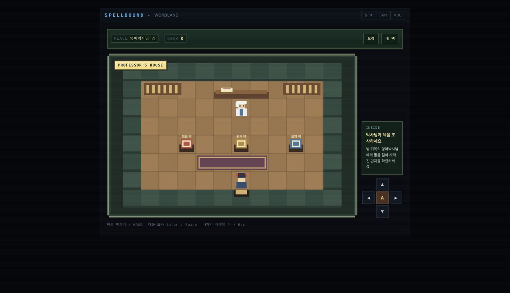
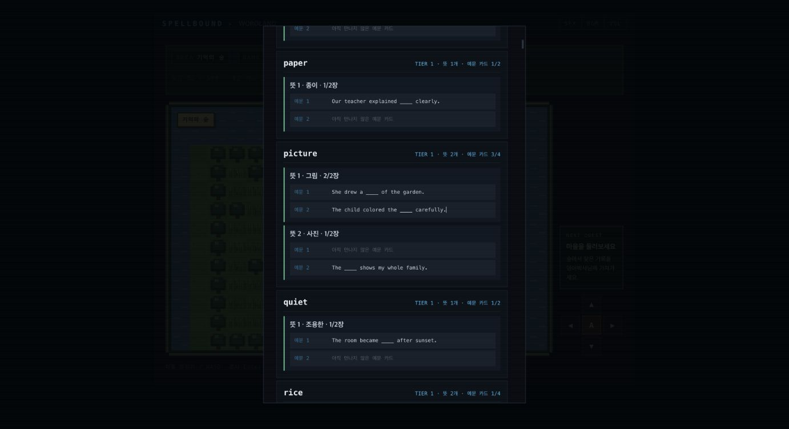
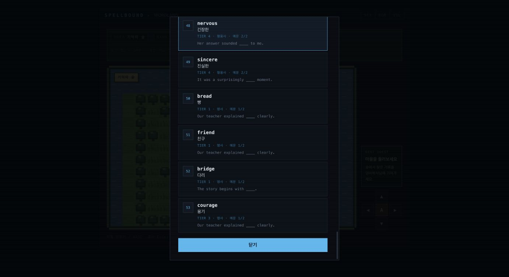

# Spellbound Web 핵심 사용자 플로우 감사

- 감사 ID: `SPELLBOUND-CORE`
- 환경: Chromium 데스크톱, `http://127.0.0.1:8798/index.html`
- 데이터 정책: 별도 localhost origin만 사용했으며 GitHub Pages 저장은 변경하지 않았다.
- 회귀 검사: `node --test test_capture_rules.mjs test_facility_rules.mjs test_world_map.mjs test_story_rules.mjs`

## 범위와 결과

주 사용자는 로그인 없는 로컬 웹 사용자다. 제품의 첫 가치는 뜻·빈칸 예문을 보고 단어를 포획해 덱과 도감을 만드는 것이며, 이후 카드정리와 랭크 대결이 핵심 반복 흐름이다.

적용 가능한 P0은 첫 덱 획득, 포획과 복구, 카드 제거, 랭크 대결, 메인 스토리, 저장 초기화다. 결제·인증·권한·외부 메시지·모바일 흐름은 현재 제품 범위에 없어 제외했다. P1에서는 덱과 도감의 다중 예문 조회를 검증했다.

| 흐름 | 우선순위 | 결과 | 확인된 성공·복구 신호 |
|---|---:|---|---|
| FLOW-01 첫 진입과 스타팅 덱 | P0 | verified | 실내 진입, 0/5 재시험, 새로고침 재개, 5/5 뒤 25장 등록 |
| FLOW-02 야생 단어 포획 | P0 | verified | 직접 정답, 0/10 복구 실패, 9/10 복구 성공 |
| FLOW-03 카드정리소 | P0 | verified | 50장 게이트, 0/5 유지, 5/5 제거, 도감 보존 |
| FLOW-04 랭크 대결 | P0 | verified | 승 +25, 무 +10, 패 -25, 1승 1패 1무 저장 |
| FLOW-05 메인 스토리 | P0 | verified | 백지 장벽, 라이벌, 숲 주민 3명, courage 복구 |
| FLOW-06 새 모험 초기화 | P0 | verified | 삭제 범위 경고, 취소 보존, 확정 초기화 |
| FLOW-07 덱·도감 조회 | P1 | verified | picture 2뜻·4예문, 덱의 서로 다른 3장 표시 |

## 웹 회귀 점검 체크리스트

아래 16개 항목을 기능 변경 후 반복 확인할 핵심 웹 플로우로 고정한다.

- [x] 1. 첫 실행 시 덱·도감 0장, 레이팅 1000으로 시작한다.
- [x] 2. 월드맵에서 이동해 영어박사님 집 문을 조사하면 전용 실내로 진입한다.
- [x] 3. 박사님 프롤로그를 본 뒤 세 개의 25장 스타팅 덱을 조사할 수 있다.
- [x] 4. 스타팅 시험 0/5 실패 뒤 같은 덱 재시험과 새로고침 재개가 가능하다.
- [x] 5. 스타팅 시험 4/5 이상 통과 뒤 확정해야만 덱·도감에 25장이 등록된다.
- [x] 6. 통과 뒤 다른 덱 고르기 선택지가 보이며, 확정 후에는 다른 덱을 고를 수 없다.
- [x] 7. 뜻·빈칸 예문·7초 감소 게이지를 보고 야생 단어를 직접 포획할 수 있다.
- [x] 8. 오답 또는 시간초과 뒤 보유 덱 복구시험으로 연결된다.
- [x] 9. 복구시험 90% 미만은 미포획, 90% 이상은 덱·도감 등록으로 끝난다.
- [x] 10. 신규 단어 3장 포획 뒤 표지판 복구, 백지단, 1번 길 해금이 이어진다.
- [x] 11. 스토리 라이벌 5라운드는 MockUser 4/5와 대결하며 레이팅을 바꾸지 않는다.
- [x] 12. 기억의 숲에서 bread·friend·bridge와 courage를 복구하고 박사님 귀환 목표로 전환된다.
- [x] 13. 카드정리소는 50장 미만을 차단하고, 50장 이상에서 현재 덱의 10%를 출제한다.
- [x] 14. 카드정리 시험 80% 미만은 덱 유지, 80% 이상은 정답 카드 한 장 제거와 도감 보존으로 끝난다.
- [x] 15. 명예의 전당은 승리 +25·무승부 +10·패배 -25를 적용하고 새로고침 뒤 전적을 유지한다.
- [x] 16. 새 모험은 삭제 범위를 경고하고, 취소 시 보존·확정 시 덱·도감·스토리·랭크를 초기화한다.

## 주요 실행 기록

### FLOW-01 — 박사님 집과 스타팅 덱

월드 좌표 `(5,21)`에서 문을 조사하자 전역 모달 대신 `professor-house` 실내 화면으로 전환됐다. 플레이어는 남쪽 문 안 `(6,6)`에서 시작했고, 박사님 `(6,2)`과 생활·관계·모험 덱 진열대가 실제 장애물과 상호작용 대상으로 동작했다. 프롤로그 뒤 관계 덱을 조사해 시험을 시작했고, 0/5 실패 후 새로고침·재입장했을 때 후보 덱 시험이 1/5부터 재개됐다. 재시험 5/5 뒤 최종 확정하자 덱과 도감에 25장이 등록됐다.

### FLOW-02 — 직접 포획과 복구시험

`moon`은 7초 시간초과 뒤 10문제 복구시험으로 연결됐고, 0/10에서 미포획됐다. 다음 `picture`는 직접 정답으로 덱 25→26, `rice`는 첫 입력을 틀린 뒤 복구시험 9/10으로 덱 26→27이 됐다. 이후 같은 실제 흐름을 반복해 덱을 50장까지 만들었다.

### FLOW-03 — 카드정리소

덱 50장에서 현재 덱의 10%인 5문제 시험이 열렸다. 0/5에서는 덱이 유지됐고, 재도전 5/5에서는 정답 카드만 제거 후보로 나왔다. `father`를 제거하자 덱은 49장으로 줄었지만 도감은 48단어·예문 카드 50장을 유지했다.

### FLOW-04 — 랭크 대결

MockUser는 세 경기 모두 첫 문제만 틀려 4/5를 기록했다. 플레이어 결과와 저장 상태는 다음과 같았다.

- 5/5 승리: 1000→1025
- 4/5 무승부: 1025→1035
- 3/5 패배: 1035→1010
- 새로고침 후: `1승 1패 1무 · RATING 1010`

### FLOW-05 — 메인 스토리

첫 3장 포획으로 Sprout Town 표지판이 복구되고 백지 장벽이 열렸다. 스토리 라이벌전은 5:4 승리했으며 비랭크라 레이팅이 유지됐다. 기억의 숲에서 `bread`, `friend`, `bridge`를 직접 복구하고 숲 중심에서 `courage`를 되찾자 다음 목표가 영어박사님 귀환으로 바뀌었다.

### FLOW-07 — 뜻·예문별 카드

도감의 `picture`는 2개 뜻 아래 4개 예문 카드를 표시했고 그중 3장이 수집 상태였다. 내 덱에서는 `picture`가 그림 예문 2장과 사진 예문 1장, 총 3개의 독립 카드로 표시됐다.

## 발견 사항과 조치

### FLOW-F-01 — 박사님 집이 공간이 아니라 문 앞 모달로 동작함

- 유형·심각도: expectation-gap / high
- 영향: FLOW-01에서 사용자가 건물에 들어갔다는 공간적 피드백이 없고, 박사님과 세 덱이 월드 오브젝트처럼 느껴지지 않았다.
- 조치: 전용 실내 캔버스, 이동 상태, 박사·세 덱 좌표, 남쪽 문 퇴장, 키보드·화면 방향 조작을 구현했다.
- 완료 증거: C-01, I-01 및 `test_world_map.mjs`의 실내 상태·장애물·출구 테스트.

현재 열린 blocker, wrong-outcome, dead-end, state-loss는 없다.

### FLOW-F-02 — 새 모험 확정 직후 실내 DECK 숫자가 이전 값으로 남음

- 유형·심각도: expectation-gap / low
- 영향: FLOW-06 초기화 직후 프롤로그가 열린 동안 실제 저장은 0장으로 초기화됐지만 영어박사님 집 상단 HUD가 이전 `DECK 52`를 잠시 표시한다.
- 원인: `confirmWordlandRestart()`가 월드맵 HUD만 갱신하고 현재 표시 중인 실내 HUD를 다시 그리지 않았다.
- 조치: 저장 초기화 직후 `renderProfessorHouseInterior()`를 호출해 프롤로그보다 먼저 실내 HUD를 갱신한다.
- 완료 증거: 32장 테스트 저장에서 초기화 확정 직후, 새로고침 없이 `DECK 0`과 `사라진 편지` 프롤로그가 함께 표시됐고 브라우저 오류는 없었다.

## 검증과 잔여 위험

- 자동 테스트 71개가 모두 통과했다.
- 브라우저에서 신규 시작부터 덱 53장, 스토리 3장 완료, 랭크 3연전까지 실제 전환과 저장을 확인했다.
- 재검증에서는 별도 신규 저장으로 스타팅 실패·재개·획득, 직접 포획, 0/10 실패, 9/10 성공, 백지단, 비랭크 라이벌, 기억의 숲과 courage 복구를 다시 통과했다.
- 기존 테스트 저장에서는 카드정리소 0/6 실패·6/6 통과·1장 제거와 랭크 무승부·승리·패배, 새로고침 후 `2승 2패 2무 · RATING 1020`을 확인했다.
- 감사 매니페스트: [flow-manifest.json](evidence/SPELLBOUND-CORE/flow-manifest.json)
- 데스크톱 웹만 범위에 포함했다. 모바일은 제품 계획에서 제외되어 검증하지 않았다.
- GitHub Pages 배포에서 기존 `DECK 50 · RATING 1010` 저장 유지와 문 조사 후 실내 전환을 재확인했다.
- FLOW-F-02를 수정하고 회귀 테스트 및 실제 브라우저에서 초기화 직후 `DECK 0` 표시를 재검증했다.
